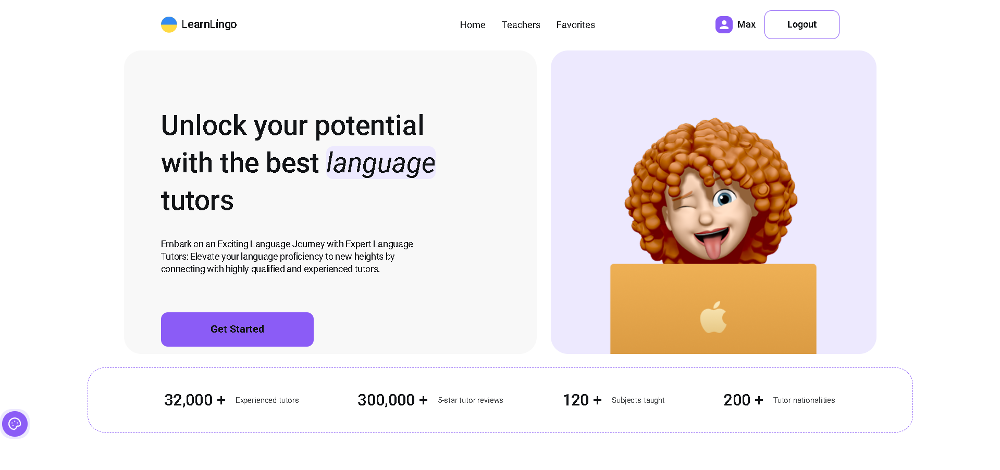
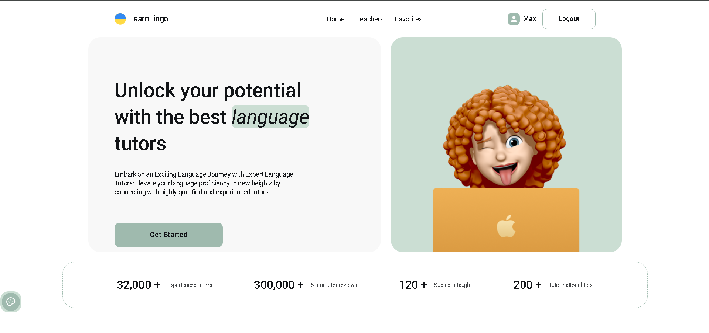
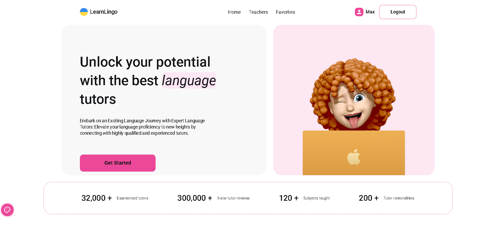
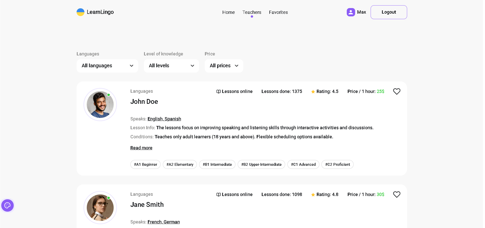
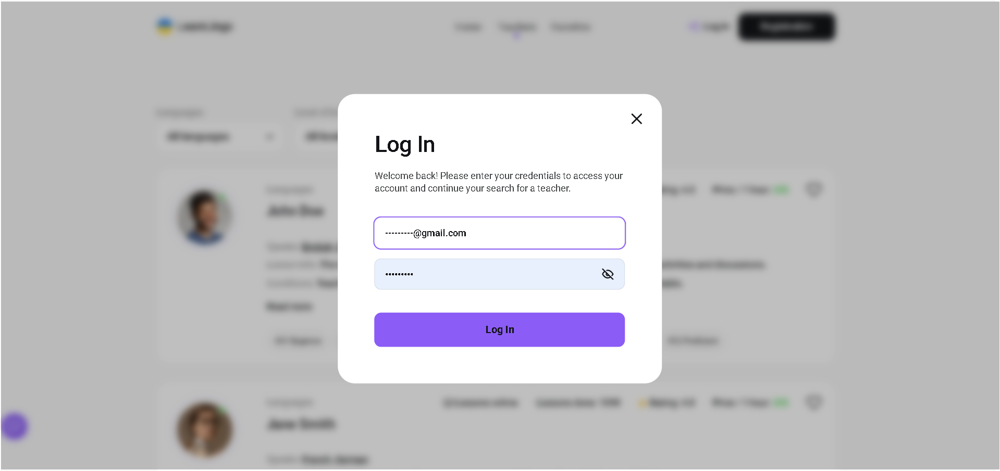
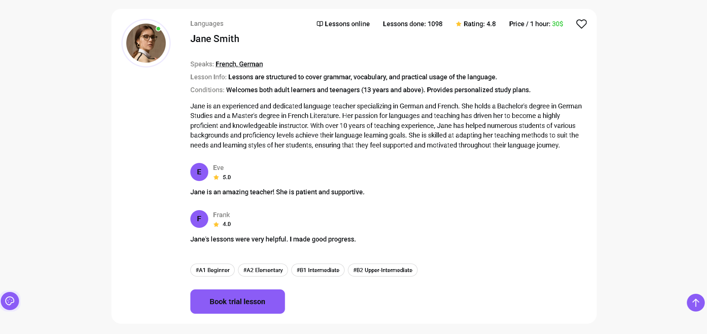

# Learn Lingo

Вебзастосунок для компанії, що надає послуги репетиторів різних мов. Проєкт
реалізований як односторінковий застосунок із нативною маршрутизацією,
авторизацією користувачів та інтерактивним каталогом вчителів.

---

## 🔗 Live Demo

- https://learn-lingo-iota-vert.vercel.app/

---

## 🎨 Макет

- Figma:  
  https://www.figma.com/design/dewf5jVviSTuWMMyU3d8Mc/Learn-Lingo?node-id=0-1&p=f&t=fROziHf6cIe8LLzz-0

---

## 📄 Технічне завдання

- Google Docs:  
  https://docs.google.com/document/d/1ZB_MFgnnJj7t7OXtv5hESSwY6xRgVoACZKzgZczWc3Y/edit?tab=t.0

---

## 📌 Сторінки застосунку

- **Home**  
  Головна сторінка з заголовком, слоганом компанії та CTA-посиланням для початку
  роботи із застосунком.

- **Teachers**  
  Сторінка з переліком вчителів, що підтримує:
  - фільтр за мовами навчання,
  - фільтр за рівнем мови навчання,
  - фільтр за ціною,
  - дозавантаження карток по кнопці **Load more**,
  - перегляд детальної інформації через **Read more**,
  - запис на консультацію через **Book**.

- **Favorites (private)**  
  Приватна сторінка з вчиттелів, доданими користувачем до обраних. Доступна лише
  для авторизованих користувачів.

---

## ✅ Функціонал

### Авторизація (Firebase)

- реєстрація користувача
- логін
- отримання даних поточного користувача
- логаут

### Вчителі (Firebase Realtime Database)

Колекція вчителів містить наступні поля:

- `name`
- `surname`
- `avatar_url`
- `experience`
- `reviews`
- `price_per_hour`
- `rating`
- `conditions`
- `languages`
- `lessons_done`
- `levels`
- `lesson_info`

Для наповнення колекції використовується файл `teachers.json`.

### Favorites

- Клік по кнопці у вигляді “серця”:
  - **неавторизований користувач** — отримує повідомлення, що функціонал
    доступний лише після авторизації
  - **авторизований користувач** — може додати або видалити психолога зі списку
    обраних
- Стан обраних зберігається після перезавантаження сторінки (через
  `localStorage` або Firebase).

### Модальні вікна

- Модальне вікно авторизації
- Модальне вікно запису на консультацію  
  Обидві форми:
  - мають мінімальну валідацію полів
  - закриваються по кліку на “хрестик”
  - закриваються по кліку на backdrop
  - закриваються по натисканню клавіші `Esc`

---

## 🧭 Маршрутизація

Маршрутизація реалізована **нативно на JavaScript** з використанням
`history.pushState()` та `popstate` без сторонніх бібліотек.  
Зміна маршруту відбувається без перезавантаження сторінки.

---

## ⚙️ Додаткові можливості

У проєкті також реалізовано кілька додаткових інтерфейсних функцій, що
покращують взаємодію користувача із застосунком.

⬆️ Scroll To Top

Кнопка швидкого повернення на початок сторінки. З’являється після прокрутки
сторінки на певну відстань і дозволяє плавно повернутися до верхньої частини
сторінки.

🎨 Theme Switcher

Перемикач тем оформлення інтерфейсу. Дозволяє користувачу змінювати тему
застосунку (наприклад, світлу або темну). Обрана тема зберігається та
застосовується при повторному відкритті сторінки.

📱 Адаптивний інтерфейс

Інтерфейс адаптований під різні розміри екранів. Компоненти коректно
відображаються на мобільних пристроях, планшетах та десктопах.

---

## 🧰 Технології

- HTML
- CSS
- JavaScript (Vanilla)
- Vite (збірка)
- Firebase (Authentication, Realtime Database)

---

## 🚀 Getting Started

First, install dependencies:

```bash
npm i
# or
yarn
# or
pnpm i
# or
bun install
```

Environment variables

Configure your environment variables:

```bash
cp .env.example .env
# Fill in: BASE_URL, etc.
```

Then, run the development server:

```bash
npm run dev
# or
yarn dev
# or
pnpm dev
# or
bun dev
```

Open [http://localhost:5173](http://localhost:5173) with your browser to see the
result.

To build the project:

```bash
npm run build
```

To preview the production build locally:

```bash
npm run preview
```

## Screenshots

### Home page - three color themes







### Tezchers catalog



### Login modal



### Teacher card


